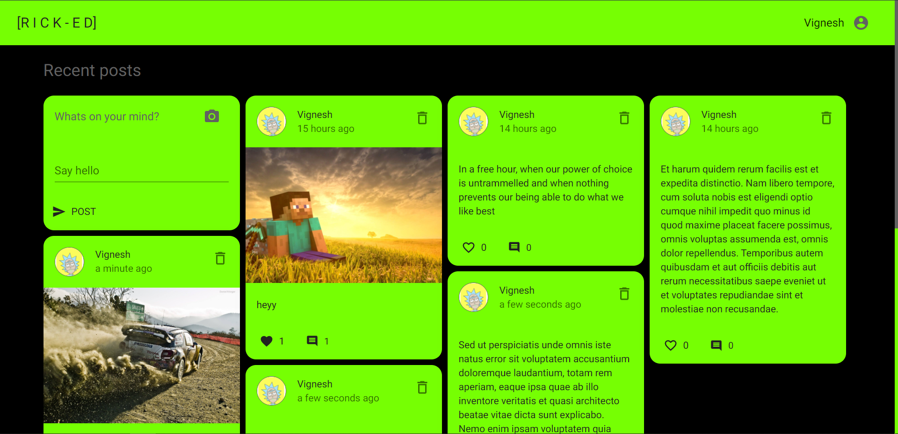
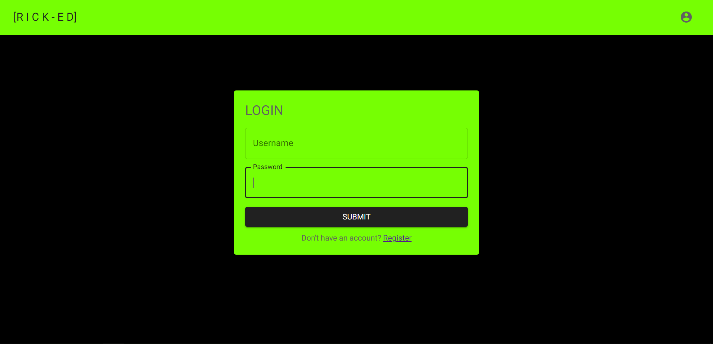
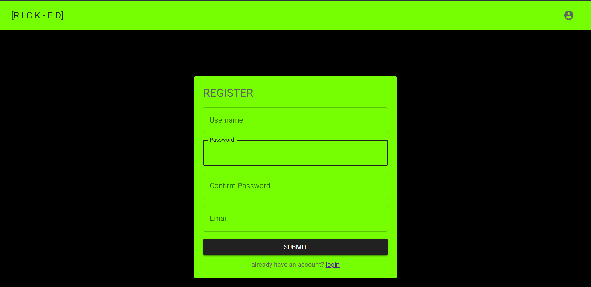
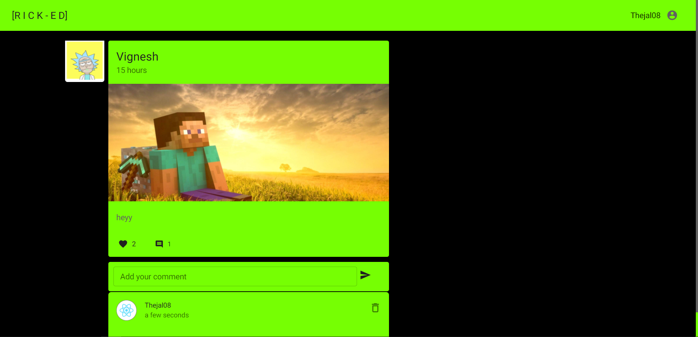

### SOCIAL-MEDIA-APP

<div>
<a href="#overview">Overview</a> | <a href="#tech_stack">Tech stack</a> | <a href="#website-link">Webiste link</a> | <a href="#preview">Preview</a>
</div>

## Overview

<div id="overview"></div>

The #2 project in my Graphql roadmap ,
This is a react application with a graphql server.
A social media app , The app lets user register an account and the user can post pictures, content,comment on posts ,like posts etc ... React context is used for centralizing application state. Apollo client is used as the grahql client in the app. it's user interface is completely designed with MUI5 . For the file storage firebase storage has been used, User authentication is managed with jsonwebtoken . The database used is MongoDB with mongoose as ODM and ive used Apollo-server in the backend.

## TECH STACK

<div id="tech_stack"></div>
  
```
React
MUI
Apollo
Firebase
Graphql
Jsonwebtoken
Node
MongoDB
Mongoose
Heroku
Netlify
```

## Preview

<div id="preview"></div>

# Home page



# Login page



# Register page



# Post page



## Website link

<div id="website-link"></div>

<a href="https://ricked.netlify.app/">Link</a>
